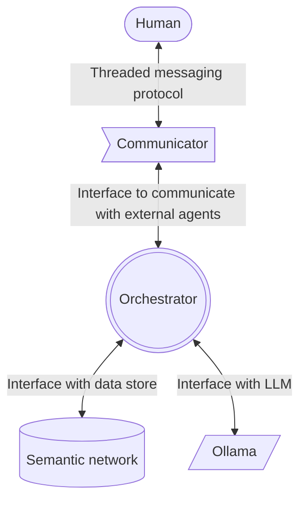

# ReasonAbleAI

See the [ReasonAbleAI GitHub Orginization for project details](https://github.com/ReasonAbleAI).

## Example deployment



Example `docker-compose.yaml`

```yaml
version: '3'
services:

  #################################
  # Orchestrator related services #
  #################################

  orchestrator-api:
    image: ghcr.io/reasonableai/orchestrator:latest
    container_name: orchestrator-api
    volumes:
      - ./settings.yaml:/app/settings.yaml
    ports:
      - "5000:5000"
    environment:
      - REDIS_URL=redis://orchestrator-redis:6379/0
      - OLLAMA_URL=http://orchestrator-ollama:11434
    depends_on:
      - orchestrator-redis

  orchestrator-worker:
    image: ghcr.io/reasonableai/orchestrator:latest
    command: celery -A celery_app worker
    container_name: orchestrator-worker
    volumes:
      - ./settings.yaml:/app/settings.yaml
    environment:
      - REDIS_URL=redis://orchestrator-redis:6379/0
      - OLLAMA_URL=http://orchestrator-ollama:11434
    depends_on:
      - orchestrator-redis

  orchestrator-flower:
    image: ghcr.io/reasonableai/orchestrator:latest
    command: celery -A celery_app flower
    container_name: orchestrator-flower
    volumes:
      - ./settings.yaml:/app/settings.yaml
    ports:
      - "5555:5555"
    environment:
      - REDIS_URL=redis://orchestrator-redis:6379/0
    depends_on:
      - orchestrator-redis

  orchestrator-redis:
    image: redis:latest
    container_name: orchestrator-redis
    ports:
      - "6379:6379"

  # See the https://ollama.ai docs for instructions on pulling models
  orchestrator-ollama:
    image: ollama/ollama:latest
    container_name: orchestrator-ollama
    ports:
      - "11434:11434"
    volumes:
      - orchestrator_ollama:/root/.ollama


  #####################
  # Semantic Networks #
  #####################

  python_semantic_network_web:
    image: ghcr.io/reasonableai/semantic-network:latest
    ports:
      - "6000:5000"
    environment:
      - NEO4J_URI=neo4j://python_semantic_network_db:7687
      - NEO4J_USERNAME=neo4j
      - NEO4J_PASSWORD=superlongsecret
      - |
        API_DOCUMENTATION=API documentation
        This API is useful for answering questions about Python coding.
    depends_on:
      - python_semantic_network_db

  python_semantic_network_db:
    image: neo4j:latest
    environment:
      - NEO4J_AUTH=neo4j/superlongsecret
    ports:
      - "7687:7687"
    volumes:
      - python_semantic_network_data:/data


  #################
  # Communicators #
  #################

  emailer_communicator:
    image: ghcr.io/reasonableai/emailer:latest
    ports:
      - "7000:5000"
    volumes:
      - ./settings.yaml:/app/settings.yaml

volumes:
  python_semantic_network_data:
  orchestrator_ollama:
```
